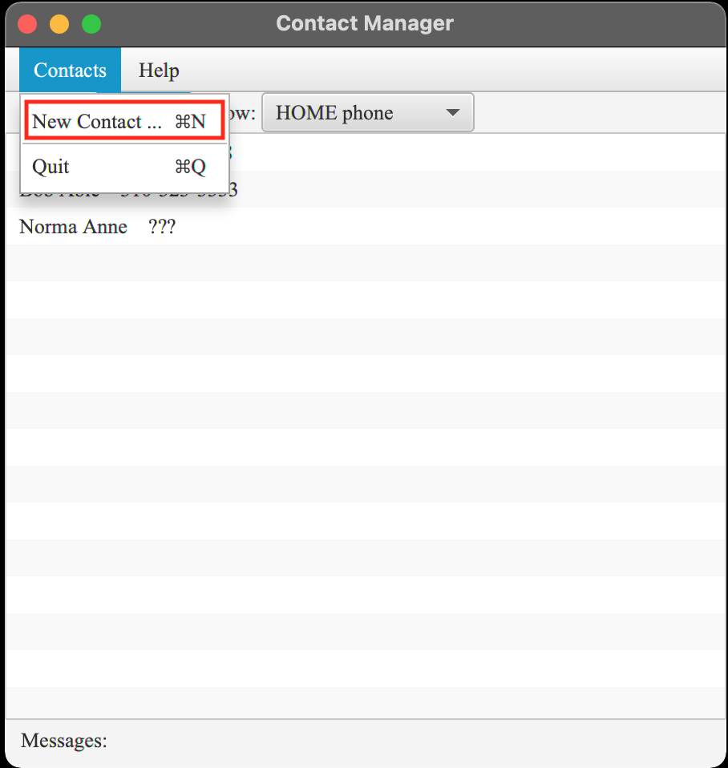
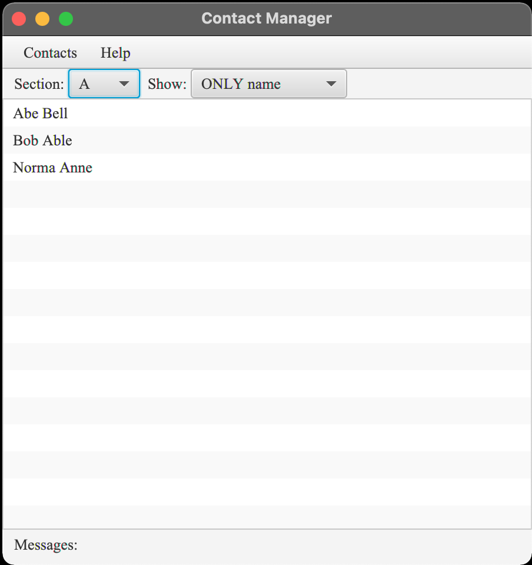
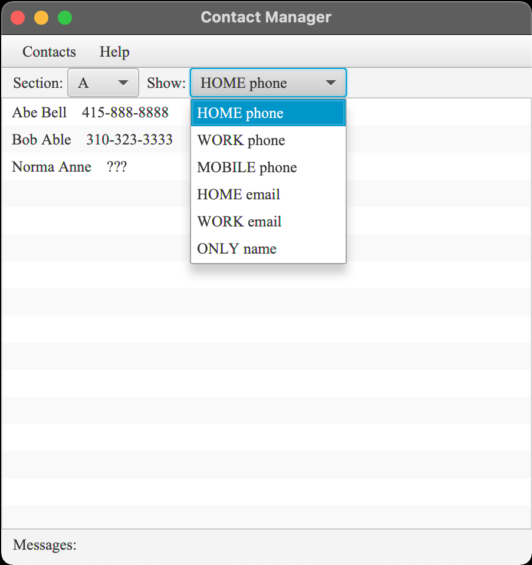
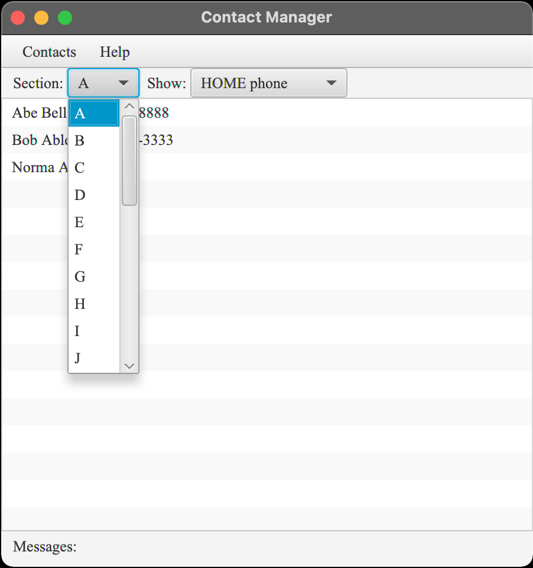
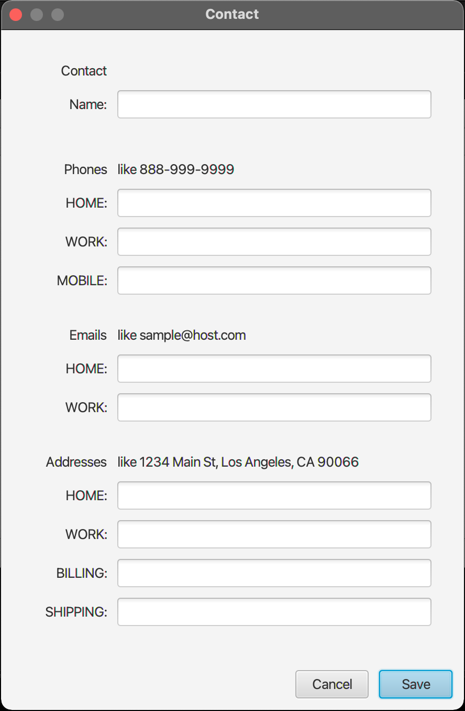
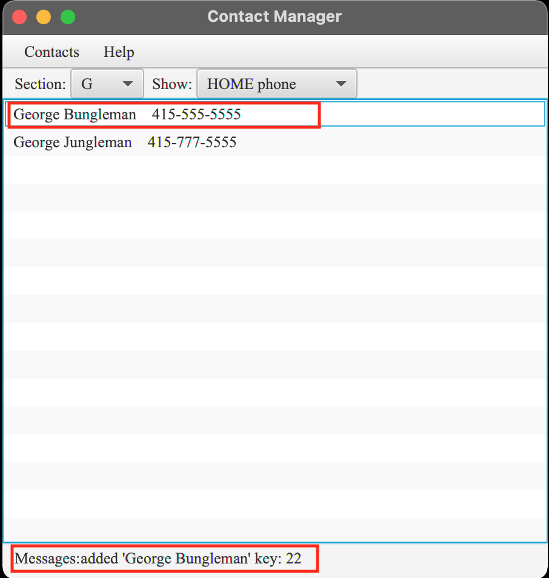
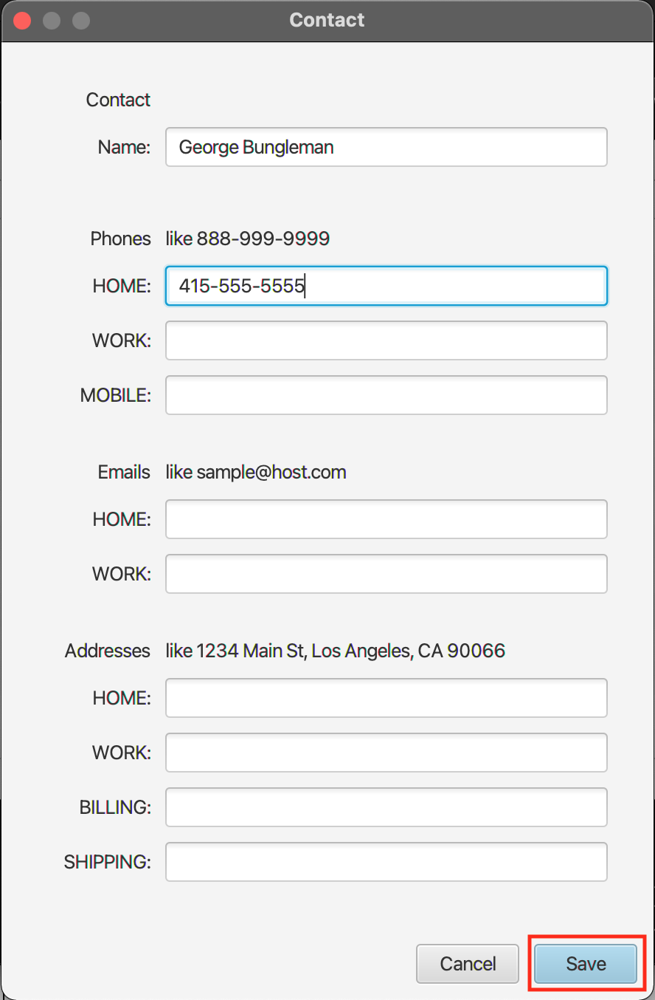
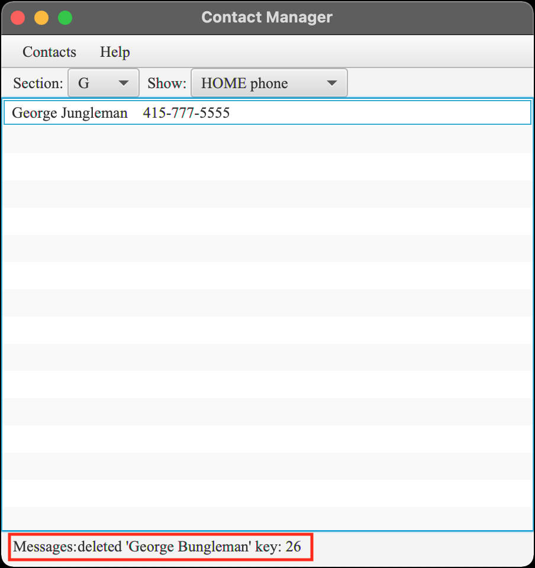
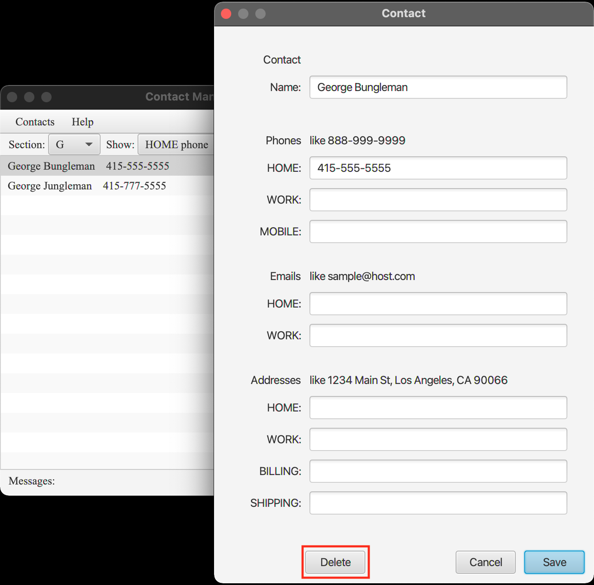

### Overview

| Package | Type | Summary |
|:------- |:---- |:------- |
| _**app**_ | AppMain | Spring Boot main entry |
| _**manager**_ | Main | JavaFX main application |
|  | MenuController | handles the menu events |
|  | ListController | manages a list of contact views |
|  | FormController | manages contact display and capture |
|  | ContactDialog  | builds and manages the contact form dialog |
|  | ContactView | views a contact from storage |
|  | ViewLoader | loads views from FXML files |
| _**services**_ | ClientProxy | local web service proxy |

### Discussion

**AppMain** uses [Spring Boot][spring-boot] to launch the **Main** [JavaFX][java-fx] application.
**ClientProxy** wraps the **IContactService** interface and fetches contacts from and stores contacts to a locally running
[contact web service][contact-service] (required).

At startup, the initial window shows a list of contacts based on the selected section A-Z.
**ListController** initializes the contact list and responds to selections in the list.
When a listed contact is selected, a form dialog gets opened with the selected contact data.
**ContactView** manages contact fetches, storage, and their views.

**ContactDialog** builds and manages the contact form dialog and data validations.
**FormController** displays and captures contact data, and manages the phones, emails, and addresses 
associated with a contact.

**MenuController** responds to menu choices, including the creation of a new contact and quitting the app.

### Operating Locally

First, be sure to start the [contact web service][contact-service] locally as it's required.
Then, you can launch the contact manager app as follows:

```
java -jar contacts-manager/target/contact-manager-*.jar
```

### Gallery

When the contact manager launches, it first checks whether the required companion web service is also running.
If not, it will launch the web service as a sub-task.

![App Launch][app-launch]

Once the web service is detected, the contact manager will open with the first available contacts listed.
New contacts can be created by selecting **New Contact** on the **Contacts** menu.




There are also ways to select a **Section** of the alphabet and what to **Show** along with the contact name.




Selecting the **New Contact** menu item will open an empty contact entry form.

<div align="center">

</div>

<br/>

Once filled, pressing the **Save** button will validate the data supplied and add the new contact using the running 
web service.
After being added to the backing data store, the contact list will be updated showing the new contact.





After such a contact has been added, it can be edited by selecting it in the contact list.
While editing a contact, **Cancel** will exit the contact without saving any pending changes.
When editing an existing contact, you can make changes and **Save** it, or you can **Delete** it.
After deleting a contact, the contact list will again be updated to reflect its absence.




Selecting **Quit** from the **Contacts** menu will exit the application and its web service (if started by the app).

[spring-boot]: https://spring.io/projects/spring-boot
[java-fx]: https://en.wikipedia.org/wiki/JavaFX
[contact-service]: ../contact-service#contact-service-api

[app-launch]: ../images/0-app-launch.png
[app-open]: ../images/1-app-open.png
[main-menu]: ../images/2-main-menu.png
[section-select]: ../images/2-section-select.png
[show-select]: ../images/2-show-select.png
[new-contact]: ../images/3-new-contact.png
[contact-added]: ../images/4-contact-added.png
[contact-edit]: ../images/4-contact-edit.png
[contact-saved]: ../images/5-contact-saved.png
